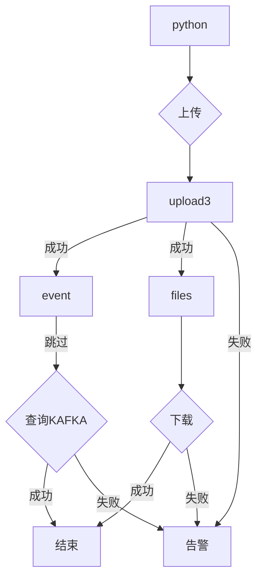
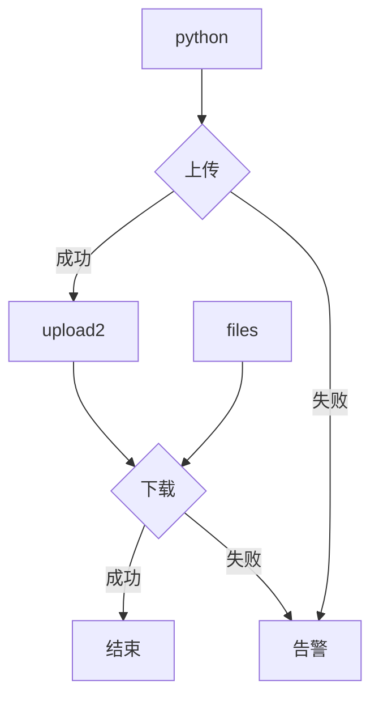
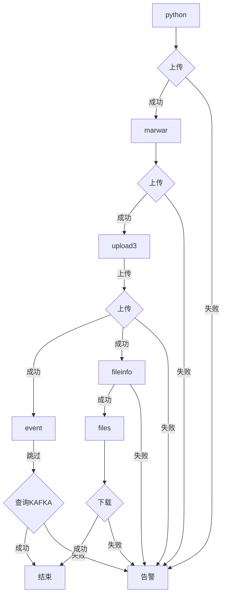

## 图片上传链路检查

### 事件图片上传流程图

```mermaid
graph TD

S[python] --> ACT_1{上传}

ACT_1{上传} --> A[upload3]
A[upload3] --> |成功| B[event]
A[upload3] --> |成功| C[files]
A[upload3] --> |失败| ALARM[告警]
B[event] --> |跳过| ACT_2{查询KAFKA}
ACT_2{查询KAFKA} --> |成功| E[结束]
ACT_2{查询KAFKA} --> |失败| ALARM[告警]
C[files] --> ACT_3{下载}
ACT_3{下载} --> |成功| E[结束]
ACT_3{下载} --> |失败| ALARM[告警]
```

### 结构化图片上传流程图

```mermaid
graph TD

S[python] --> ACT_1{上传}
ACT_1{上传} --> |成功| A[upload2]
ACT_1{上传} --> |失败| ALARM[告警]

A[upload2] --> ACT_2{下载}
B[files] --> ACT_2{下载}
ACT_2{下载} --> |成功| E[结束]
ACT_2{下载} --> |失败| ALARM[告警]
```

### 爱耳目图片上传流程图

```mermaid
graph TD

S[python] --> ACT_1{上传}

ACT_1{上传} --> |成功| A[marwar]
ACT_1{上传} --> |失败| ALARM[告警]

A[marwar] --> ACT_2{上传}
ACT_2{上传} --> |成功| B[upload3]
ACT_2{上传} --> |失败| ALARM[告警]

B[upload3] --> |上传|ACT_3{上传}
ACT_3{上传} --> |成功| C[event]
ACT_3{上传} --> |成功| D[fileinfo]
ACT_3{上传} --> |失败| ALARM[告警]

C[event] --> |跳过| ACT_4{查询KAFKA}
ACT_4{查询KAFKA} --> |成功| F[结束]
ACT_4{查询KAFKA} --> |失败| ALARM[告警]

D[fileinfo] --> |成功| E[files]
D[fileinfo] --> |失败| ALARM[告警]

E[files] --> ACT_5{下载}
ACT_5{下载} --> |成功| F[结束]
ACT_5{下载} --> |失败| ALARM[告警]
```
